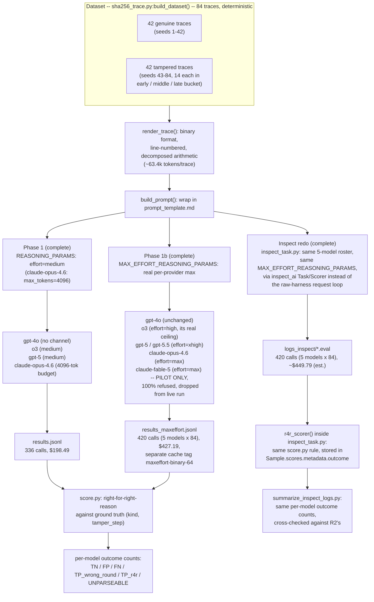
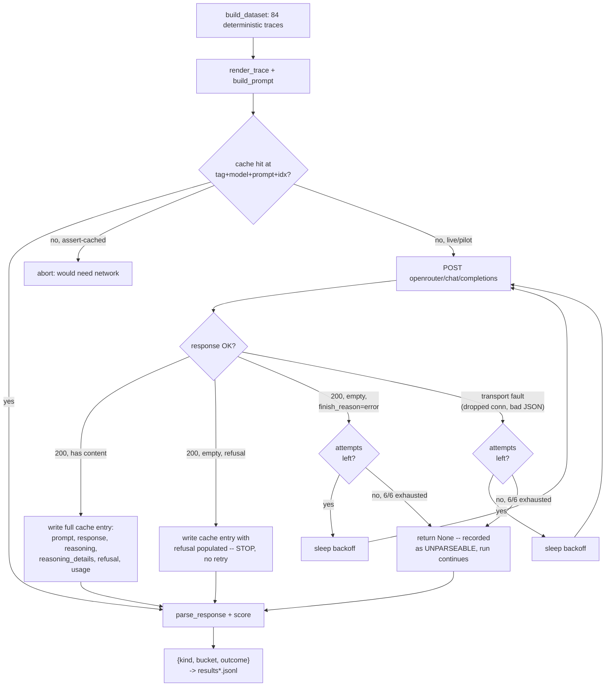
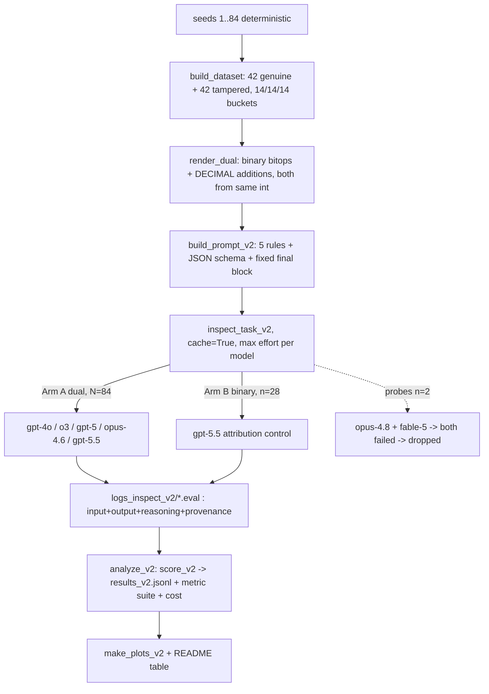
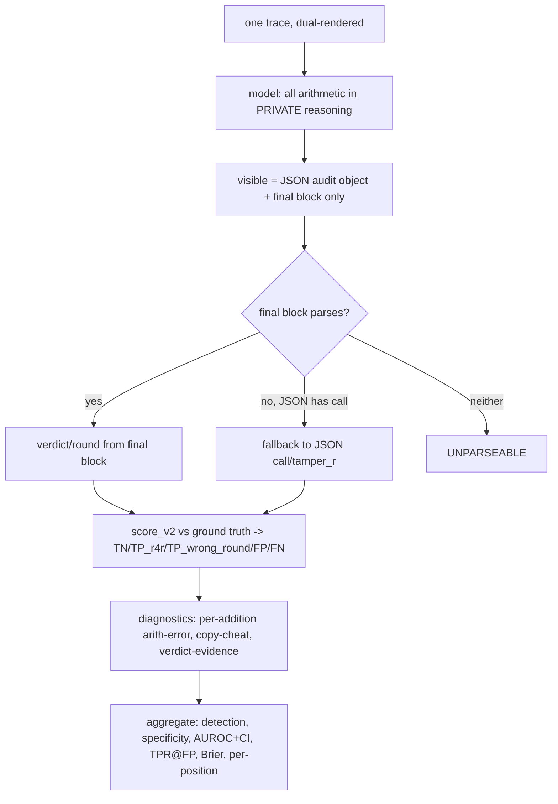

# What this is

The curated mechanistic map of the trace-verification harness. Read this alone to understand how it works and where each piece lives. Every path below is real, executed code -- see `README.md` for the medium- and max-effort raw-trace-run results.

# Experimental setup, full picture



Model selection rationale differs by phase: Phase 1's 4 models are chosen by published METR 50%-time-horizon (cheapest per horizon tier); Phase 1b's 2 additions (`claude-fable-5`, `gpt-5.5`) are chosen by Epoch Capability Index (epoch.ai/eci) rank instead, to test a genuinely-more-capable model rather than only a longer-horizon one. Both phases share the same dataset, prompt, base format, and scoring rule -- only the model roster and reasoning-effort setting differ, so the two `results*.jsonl` files are a controlled medium-vs-max-effort comparison. The Inspect redo (`inspect_task.py`) is a third, independent pass over the same Phase 1b dataset/prompts/settings, through `inspect_ai`'s `Task`/`Scorer` machinery instead of `run_experiment.py`'s raw request loop, run once results/README.md's "Inspect redo" section for the cross-validation this gives.

# Current map

| Component | Path | What it does |
|-----------|------|---|
| Trace generator + tamper injector | `sha256_trace.py` | Deterministic, seeded SHA-256 compute, verified against `hashlib`; injects one self-consistent single-bit tamper at a chosen round; renders the full trace text a model sees. |
| Scorer | `score.py` | Parses `VERDICT`/`ROUND` from a model response; applies right-for-right-reason scoring against ground truth. |
| Prompt template | `prompt_template.md` | Verbatim instruction text wrapping `{trace}`. |
| Harness (raw) | `run_experiment.py` | Builds the 84-trace dataset, builds prompts, calls OpenRouter (cached), writes `results.jsonl` / `results_maxeffort.jsonl`. Has `--dry-run`/`--pilot`/`--live`/`--assert-cached` (Phase 1), `--pilot-max-effort`/`--live-max-effort`/`--assert-cached-max-effort` (Phase 1b), and `--ablate-format`/`--ablate-length` (each composable with `--assert-cached`) modes. |
| Harness (Inspect) | `inspect_task.py` | Same dataset/prompt/scoring, reused directly (not reimplemented) from the modules above, run through `inspect_ai`'s `Task`/`Scorer` API instead of a raw request loop. Per-model `reasoning_effort`/`max_tokens` read straight from `run_experiment.py`'s `MAX_EFFORT_REASONING_PARAMS`/`COMPLETION_MAX_TOKENS` (single source of truth). Run one model at a time via `inspect eval` (see `README.md`'s Reproduce section for the 5 commands); no cache-replay mode exists for this harness, unlike `run_experiment.py`'s `--assert-cached`. |
| Log summarizer (Inspect) | `summarize_inspect_logs.py` | Reads `logs_inspect/*.eval`, recomputes the same outcome table `score.py` produces for the raw harness. Handles a real `inspect_ai` 0.3.189 bug (below) via a raw-zip fallback for the one log it affects. |

# Pseudocode

## `sha256_trace.py:compress`
```
state = H0  # 8 initial hash words
for t in 0..63:
    S1, ch, temp1 = derived from e,f,g,h + K[t] + W[t]
    S0, maj, temp2 = derived from a,b,c
    new_a = temp1 + temp2 (mod 2^32)
    new_e = d + temp1 (mod 2^32)
    b,c,d,f,g,h shift down from a,b,c,e,f,g

    if t == tamper_step:
        new_a ^= (1 << tamper_bit)   # the only deliberate deviation from real SHA-256

    record every intermediate value for round t (not just new state)
    advance a..h = new_a..new_h
return per-round records, final hash words
```

## `sha256_trace.py:generate_genuine(seed)` / `generate_tampered(seed, bucket)`
```
generate_genuine(seed):
    msg = 50 deterministic pseudo-random bytes from seed
    block = pad_single_block(msg)
    W = compute_message_schedule(block)
    rounds, final = compress(W)                       # no tamper_step
    assert hash_hex(final) == hashlib.sha256(msg).hexdigest()   # correctness gate
    return {message, W, rounds, final, digest}

generate_tampered(seed, bucket):
    msg, block, W = same as above
    tamper_step = random choice within POSITION_BUCKETS[bucket]  # early/middle/late
    tamper_bit  = random 0..31
    genuine_rounds, _  = compress(W)                    # no tamper, for comparison
    tampered_rounds, final = compress(W, tamper_step, tamper_bit)
    assert tampered_digest != genuine_digest                        # tamper propagated
    assert genuine_rounds[:tamper_step] == tampered_rounds[:tamper_step]  # no upstream leak
    assert genuine_rounds[tamper_step:] != tampered_rounds[tamper_step:]  # downstream changed
    return {..., tamper_step, tamper_bit, bucket}
```

## `sha256_trace.py:render_trace(trace)`
```
print message hex
print W[0..63] each on its own line
for each round record:
    print K[t], W[t]
    print inputs a..h
    print S1, ch, temp1, S0, maj, temp2   # every intermediate, not a summary
    print new a, new e, and the shifted b/c/d/f/g/h
print final digest
```
Deliberately this verbose (~22.8k tokens/trace) so the model faces the same arithmetic depth chippy's design used, not a compressed summary that would make the task meaningfully easier.

## `score.py:score(ground_truth_is_tampered, ground_truth_round, parsed_response)`
```
if parsed verdict missing: return UNPARSEABLE
if not ground_truth_is_tampered:
    return FP if model said TAMPERED else TN
# ground truth IS tampered
if model said GENUINE: return FN
if model's claimed round == ground_truth_round: return TP_r4r
else: return TP_wrong_round        # said tampered, wrong round -> counts as a miss
```

## `run_experiment.py:build_dataset()`
```
items = []
seed = 0
repeat 42 times: seed += 1; items.append(genuine trace at seed)
for bucket in [early, middle, late]:
    repeat 14 times: seed += 1; items.append(tampered trace at seed, bucket)
return items   # 84 items total, fully deterministic given the fixed loop order
```

## Step 1 -- model rosters and reasoning settings: `MODELS` / `NEW_MODELS` / `LIVE_MAX_EFFORT_MODELS` / `REASONING_PARAMS` / `MAX_EFFORT_REASONING_PARAMS`

Two separate model/reasoning-setting pairs exist side by side, one per phase. `run_main()` uses the first pair; `run_max_effort()` uses the second.

```
MODELS = {                                     # Phase 1, keyed by METR 50%-horizon tier
    horizon_7min:   openai/gpt-4o,
    horizon_120min: openai/o3,
    horizon_203min: openai/gpt-5,
    horizon_719min: anthropic/claude-opus-4.6,
}
NEW_MODELS = {                                 # Phase 1b additions, keyed by Epoch Capability Index rank
    eci_161_fable5: anthropic/claude-fable-5,  # pilot only -- see Step 4
    eci_159_gpt55:  openai/gpt-5.5,
}
ALL_MODELS = MODELS + NEW_MODELS               # used for the n=8 pilot (--pilot-max-effort)
LIVE_MAX_EFFORT_MODELS = MODELS + {eci_159_gpt55: openai/gpt-5.5}   # used for the full --live-max-effort run
                                                                     # (claude-fable-5 dropped, see Step 4)

REASONING_PARAMS = {                           # Phase 1: deliberately NOT maximum for any model
    gpt-4o:            none (no hidden reasoning channel; writes CoT straight into the visible completion)
    o3:                {effort: medium}
    gpt-5:              {effort: medium}
    claude-opus-4.6:   {max_tokens: 4096}      # explicit thinking-token budget, small vs the 128k cap
}
MAX_EFFORT_REASONING_PARAMS = {                # Phase 1b: each model's REAL ceiling, confirmed by direct
    gpt-4o:            none                    # API probe, not by trusting OpenRouter's docs uniformly --
    o3:                {effort: high}          # o3 (o3-2025-04-16) 400s on "xhigh"/"max": only low/medium/high
    gpt-5:              {effort: xhigh}         # gpt-5/gpt-5.5 accept "xhigh" (200 OK, confirmed)
    claude-opus-4.6:   {effort: max}           # Claude models accept "max" (200 OK, confirmed)
    claude-fable-5:    {effort: max}
    gpt-5.5:           {effort: xhigh}
}
COMPLETION_MAX_TOKENS = {                      # same for both phases -- each model's REAL provider ceiling,
    gpt-4o: 16384, o3: 100000, gpt-5: 128000,  # pulled live from OpenRouter's top_provider.max_completion_tokens
    claude-opus-4.6: 128000, claude-fable-5: 128000, gpt-5.5: 128000,
}
```

## Step 2 -- one API call, with its retry logic: `call_model(model, prompt, api_key, reasoning_params, max_attempts=6)`

A single call can fail three structurally different ways, and the code now treats each differently rather than lumping them into one generic "empty response" case: a **transport fault** (dropped connection, garbled JSON body) is retried; a **provider-side generation fault** (`finish_reason: "error"`, seen repeatedly on `gpt-5.5`) is also retried, since it's cheap (near-zero tokens burned) and usually transient; a **content-policy refusal** (`native_finish_reason: "refusal"`, seen consistently on `claude-fable-5`) is NOT retried -- it's the model's real, repeatable answer, and retrying would just spend money to get the same refusal again.

```
body = {model, messages: [user: prompt], max_tokens: COMPLETION_MAX_TOKENS[model]}
if reasoning_params: body.reasoning = reasoning_params

for attempt in 0..5:                                        # 6 attempts total, backoff 5/10/20/40/80/160s
    try:
        POST openrouter/chat/completions, timeout=900s
        data = response.json()
        message = data.choices[0].message
        response_text      = message.content
        reasoning_text      = message.reasoning              # captured from 2026-07-07 on (was discarded before)
        reasoning_details   = message.reasoning_details       # structured variant, same cutover
        refusal             = message.refusal                 # populated only on a real content-policy refusal
        usage               = data.usage

        if response_text is empty:
            if refusal or finish_reason == "refusal":
                return response_text, reasoning_text, reasoning_details, refusal, usage   # STOP, don't retry
            if finish_reason == "error":
                log a warning; sleep(backoff); continue        # RETRY -- transient provider fault
            log a warning (cap likely exhausted by hidden reasoning)   # accepted as-is, e.g. finish_reason=length
        return response_text, reasoning_text, reasoning_details, refusal, usage

    except (RequestException, KeyError, ValueError) as e:
        log a warning; sleep(backoff); continue                # RETRY -- transport-layer fault

# only reached after 6 attempts all failed:
log a warning; return None, None, None, None, {}               # degrade to an empty/UNPARSEABLE result,
                                                                 # do NOT crash the whole run (this used to
                                                                 # raise, which twice killed the Phase-1
                                                                 # ThreadPoolExecutor mid-run)
```

## Step 3 -- cache-or-call for one (trace, model) pair: `_call_one(idx, item, model, mode, tag, base, decompose_add, api_key, reasoning_params)`

```
trace_text = render_trace(item.trace, base, decompose_add)
prompt = build_prompt(trace_text)
key = sha256(f"{tag}|{model}|{prompt}|{idx}")[:24]     # tag differs by phase: "main-..." (Phase 1) vs
path = cache/{key}.json                                 # "maxeffort-..." (Phase 1b) -- never collide

if path exists:
    load {model, prompt_hash, prompt, response, reasoning, reasoning_details, refusal, usage} from disk
    # no network call. NOTE: cache entries written before 2026-07-07 only have
    # {model, prompt_hash, response, usage} -- the newer fields are simply absent on those.
elif mode == "assert-cached":
    raise loudly ("would need the network")            # proves full reproducibility when it does NOT trigger
else:
    response_text, reasoning_text, reasoning_details, refusal, usage = call_model(model, prompt, api_key, reasoning_params)
    write {model, prompt_hash: key, prompt, response: response_text, reasoning: reasoning_text,
           reasoning_details, refusal, usage} to path   # full prompt + reasoning + refusal now persisted

parsed = parse_response(response_text)                   # already robust to None/empty (score.py)
outcome = score(item.kind == tampered, item.trace.tamper_step, parsed)
return idx, {model, kind, bucket, outcome}, usage
```

## Step 4 -- one model roster through the shared thread pool: `run_variant(mode, models, reasoning_params_by_model, tag_prefix, results_filename, n_pilot, base, n_rounds)`

Both `run_main()` (Phase 1) and `run_max_effort()` (Phase 1b) are thin wrappers around this one function -- they only differ in which `models`/`reasoning_params`/`tag_prefix`/`results_filename` they pass in, so the two phases share identical concurrency and retry behavior by construction, not by coincidence.

```
items = build_dataset(n_rounds); if mode == "pilot": items = items[:n_pilot]
tag = f"{tag_prefix}-{base}-{n_rounds}"
pool = ThreadPoolExecutor(max_workers=16)

for idx, item in items:                    # round-robin submission: one task per model per trace
    for tier, model in models:             # index, NOT all-of-model-A then all-of-model-B -- the pool's
        pool.submit(_call_one, idx, item, model, mode, tag, base, True, api_key,   # queue is FIFO, so
                     reasoning_params_by_model[model])                             # block-order submission
                                                                                     # would starve the slow
                                                                                     # models (opus-4.6,
                                                                                     # gpt-5.5) behind the
                                                                                     # fast models' backlog
collect all futures as they complete -> all_results
if mode == "pilot": results_filename = results_filename with "_pilot" inserted before the extension
                     # (a real bug, hit and fixed 2026-07-08: pilot and live modes used to share the
                     # SAME filename, so re-running --pilot-max-effort after the live run completed
                     # silently overwrote the 420-row live results with a 56-row pilot result. Recovered
                     # only because the underlying per-call cache was untouched -- --assert-cached-max-effort
                     # regenerated the correct file with zero new API calls. "live" and "assert-cached"
                     # still share the canonical filename on purpose: assert-cached is SUPPOSED to
                     # reproduce it byte-identical, that's the whole point of the check.)
write all_results to {results_filename}
```
`run_main(mode, ...)` = `run_variant(mode, MODELS, REASONING_PARAMS, "main", "results.jsonl", ...)`.
`run_max_effort(mode, ..., models=None)` = `run_variant(mode, models or ALL_MODELS, MAX_EFFORT_REASONING_PARAMS, "maxeffort", "results_maxeffort.jsonl", ...)`. The CLI's `--live-max-effort`/`--assert-cached-max-effort` pass `models=LIVE_MAX_EFFORT_MODELS` explicitly (5 models, `claude-fable-5` excluded); `--pilot-max-effort` leaves `models=None` and gets the default `ALL_MODELS` (7 models: the original 4 plus `claude-fable-5`, `gpt-5.5`, `claude-opus-4.8`) so refusal/failure findings on any candidate model stay on record even if it never joins the live roster.

`--dry-run` short-circuits before any of this: it only computes token counts via tiktoken, zero network, zero cost.

# Known gap (as-built, dated)

Cache entries written **before 2026-07-07** (all 336 Phase-1 calls, plus the ablation-search calls) only have `{model, prompt_hash, response, usage}` -- two things a reviewer might want when auditing a specific call are missing:
1. **The raw prompt text.** Only its hash was stored. It is exactly reconstructible (same seed -> same `render_trace`/`build_prompt` output, confirmed byte-identical by `--assert-cached` matching all 336 cached calls with zero new network calls), but reading it back required running code, not opening a JSON file. Fixed going forward (Step 3 above); not retroactively fixable for old entries without paying to re-call (which would also produce different, not the same, output).
2. **Reasoning/thinking content and refusal text.** `call_model` used to read only `choices[0].message.content`. If OpenRouter's response also included `message.reasoning`/`message.reasoning_details`/`message.refusal`, those fields were read and then discarded, never written to any cache file. Unrecoverable for the 336 Phase-1 calls; fixed going forward (Step 2/3 above).

**A real `inspect_ai` 0.3.189 bug (found 2026-07-08, not this project's code):** `GenerateConfig.reasoning_effort="max"` is accepted for making the actual OpenRouter API call, but the *persisted* `EvalLog.plan.config` schema's `Literal` type does not include `"max"` (only `none/minimal/low/medium/high/xhigh`) -- so `read_eval_log()` raises a pydantic `ValidationError` on `log_finish` for any run that used `effort="max"` (only `claude-opus-4.6` in this project, the sole model whose `MAX_EFFORT_REASONING_PARAMS` entry is `"max"` rather than `"high"`/`"xhigh"`). The `.eval` file itself is not corrupted -- confirmed via `zipfile.testzip()` and the presence of all 84 `samples/*.json` entries -- so `summarize_inspect_logs.py` reads that one file's raw sample JSON directly out of the zip instead of through `read_eval_log()`.

# Control flow (as of Phase 1b, both retry paths and the refusal short-circuit shown)



# Review order

1. `/home/ram/obsidian/experiments/260706-credible-deals-polish/rq3-replication/sha256_trace.py` — the foundation; run its `__main__` self-test first.
2. `/home/ram/obsidian/experiments/260706-credible-deals-polish/rq3-replication/score.py` — scoring rule, self-tested.
3. `/home/ram/obsidian/experiments/260706-credible-deals-polish/rq3-replication/prompt_template.md` — exact text sent to a model.
4. `/home/ram/obsidian/experiments/260706-credible-deals-polish/rq3-replication/run_experiment.py` — the harness tying it together; only `--dry-run` has been run.

---

# Phase 3 (maximally-observable redesign) — as-built map (2026-07-11)

New files, each a sibling of the Phase 1/1b code (which is untouched; `--assert-cached` still reproduces Phase 1/1b):

- `sha256_trace.py :: render_dual(trace, line_numbers, binary_bitops, binary_new, decimal_additions)` — dual binary+decimal renderer (additions in DECIMAL, bitops in binary, state in both). `local_consistency_report(trace)` — Stage-0 verifier (genuine → [], tampered → exactly [(tamper_step,'new_a')]). `python3 sha256_trace.py --dry-run` — token count over 84 traces.
- `prompt_template_v2.md` + `run_experiment.py :: build_prompt_v2()` — short 5-rule prompt + JSON schema (keys `call`/`tamper_r`, no VERDICT:/ROUND: collision). `ECI_SCORES`, `PRICES`, `call_cost()` added to run_experiment.py as the single source of truth.
- `score_v2.py` — `extract_json`, `parse_response_v2` (final-block-first / JSON-fallback), `score_v2` (reuses score.py rule), `is_strict_mechanism`, `true_and_printed_sums`, `arithmetic_error_stats`, metrics `auroc`/`bootstrap_auroc_ci`/`tpr_at_fpr`/`brier`; `_selftest()` covers the 8 audited bug classes. Must pass before any spend.
- `inspect_task_v2.py` — Inspect `Task`/`Scorer`; `generate(cache=True)` (free replay); levers `renderer`/`prompt_variant`/`reasoning_effort`/`max_tokens`/`pilot_n`/`balanced_n` all `-T`; scorer stores every metric input + full provenance in `Score.metadata`.
- `stage0_render.py` (invariant proof + example artifacts), `analyze_v2.py` (logs → `results_v2.jsonl` + metric suite + cost, raw-zip fallback for the effort=max log bug), `make_plots_v2.py` (scaling + before/after plots). Audit layer: `artifacts/` + `artifacts/README.md`.

## Full experimental setup (Phase 3)



## Control flow (per trace, Phase 3)



## Result (Phase 3): hypothesis confirmed

Reformatting the SAME 84 traces for checkability moved detection from a 19% ceiling to 100% (opus-4.6) / 88% (gpt-5.5) / 52% (gpt-5); 3/5 pass the pre-registered bar; detection scales with ECI. Arm B attributes the gain to decimal rendering (binary 3.6% arithmetic error → decimal 0.01%). The binding constraint was observability + carry-slip error-compounding, not capability. gpt-4o (no reasoning) and o3 (off-trend) do not improve. Total $458.80; zero-new-call replay proven. Full numbers in README.md.
