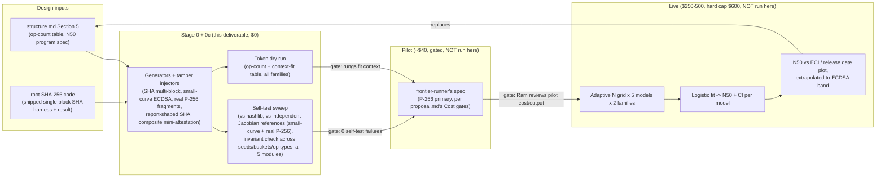

# What this is

Stage 0 (and Stage 0c) of the N50 ops-horizon experiment: zero-API-call generators, tamper injectors, self-tests, and a token dry run. No model has been called yet; everything below is pure local computation. Read this file alone to understand how the code works. (The design rationale and the append-only run history live in the experiment's private working notes `proposal.md` and `plan.md`, which are not included in this public package.)

# Current map

| Component | Path | What it does |
|---|---|---|
| Parent SHA-256 primitives (extended, not duplicated) | `../src/sha256_trace.py` | Single-block SHA-256 generator, dual renderer, invariant checker. Extended with four backward-compatible kwargs: `compress(..., init_state=, start_round=)` and `render_dual(..., binary_state=, tag_op_types=)`. Every existing call site and shipped artifact re-verified byte-identical after the extension (see Review order). |
| Multi-block SHA generator + renderer | `sha256_multiblock.py` | Chains the parent's `compress()` across N 64-byte blocks (real Merkle-Damgard), genuine + `addition`-class tamper, dual and decimal-densified rendering, invariant checker. `message=` override (backward-compatible) lets `report_payload.py` reuse this unmodified. |
| SHA tamper-class stratification | `sha256_tamper_classes.py` | `bitwise` and `schedule_word` tamper classes, cascading a mid-round flip through the rest of the block/message via the parent's `start_round`/`init_state`. |
| Small-curve ECDSA generator + renderer | `ecdsa_trace.py` | Constructs a small elliptic curve (8/12/16-bit prime field, brute-force point counting + cofactor-clearing generator selection); traces the FULL real ECDSA verification algorithm (w, u1, u2, both double-and-add ladders, final point addition, v) decomposed to word-scale lines via a formula-based DSL; independent Jacobian-coordinate reference verify (general `a`, so `p256_trace.py` reuses it); unified line-level tamper mechanism; `decompose_multiply_linear` (linear, not pointwise) plus `pointwise_line_count` for the ratio report. |
| **Real P-256 verification fragments (Stage 0c, PRIMARY family)** | `p256_trace.py` | Real NIST P-256 curve constants, general Weierstrass `a`-term. `traced_mulmod`/`check_mulmod`: named, tamperable, checkable multi-line multiplication (linear decomposition), integrated into a generalized formula DSL (`eval_formula_v2`/`check_formula_v2`) that mixes 1-line "simple" steps with many-line "bigmult" steps. `run_ladder_fragment` + `_fast_forward` draw a contiguous N-op span from a REAL, complete signature verification via a shared flat op-sequence (`_ladder_op_sequence`) both functions walk in lockstep. |
| **Report-shaped SHA payloads (Stage 0c)** | `report_payload.py` | Builds an exact-length, labeled attestation-report-style message (`MEAS=... NONCE=... TS=... FILL=...`); reuses `sha256_multiblock.py`'s generator/tamper/render/check via its `message=` override. |
| **Composite mini-attestation (Stage 0c)** | `mini_attestation.py` | Chains `report_payload.py`'s digest into `p256_trace.py`'s `z` (via its `z=` override); tamper lands in either half, weighted by real line count; the untampered half is fully regenerated when its neighbor's output changes (downstream-recompute rule applied across the hash-then-sign seam). |
| Stage 0 self-test sweep | `stage0_selftest.py` | Runs every invariant above (all 5 modules) across many seeds, rungs, buckets, and classes; writes example artifacts. |
| Token dry run | `token_dry_run.py` | tiktoken counts per rung, every rendering, all families; reports which of the five models' context windows each rung fits. |

# Pseudocode

## `../src/sha256_trace.py:compress` (extended)

```
compress(W, tamper_step=None, tamper_bit=None, n_rounds=64, init_state=None, start_round=0):
    init_state defaults to H0 (the fixed SHA-256 IV)
    a..h = init_state
    for t in range(start_round, start_round + n_rounds):
        # standard SHA-256 round: S1, ch, step1..step3, temp1, S0, maj, temp2, new_a, new_e
        if t == tamper_step: new_a ^= (1 << tamper_bit)   # original single-class mechanism
        record round dict {t, K, W, a_in..h_in, S1, ch, step1..temp2, a..h}
        a..h = new_a..new_h
    final = [init_state[i] + <final a..h>[i] mod 2^32 for i in 0..7]
    return rounds, final
```
`init_state` is what lets `sha256_multiblock.py` chain blocks without re-implementing the round loop: pass block *i*'s `final` as block *i+1*'s `init_state`. `start_round` is what lets `sha256_tamper_classes.py` resume compression mid-block from an already-tampered round's shifted state, to cascade a bitwise/schedule-word tamper class through the rest of the message using the *same* loop instead of a second copy of it.

## `sha256_multiblock.py:generate_genuine`

```
generate_genuine(seed, n_blocks):
    msg = n_blocks*64 - 9 random bytes   # exact length: padding fills to n_blocks blocks, zero waste
    padded = pad_multi_block(msg, n_blocks)
    blocks = split padded into n_blocks 64-byte chunks
    state = H0
    for block in blocks:
        W = compute_message_schedule(block)          # imported, unmodified
        rounds, final = compress(W, init_state=state)  # imported, extended
        record {W, rounds, final}; state = final
    digest = hash_hex(state)
    assert digest == hashlib.sha256(msg).hexdigest()   # the load-bearing self-test
    return trace
```

## `sha256_multiblock.py:generate_tampered`

```
generate_tampered(seed, bucket, n_blocks):
    total_rounds = n_blocks * 64
    global_step = random choice within the bucket's third of range(total_rounds)
    tamper_block, tamper_round = divmod(global_step, 64)
    genuine = compress every block chained (as above)
    tampered = same, but compress(tamper_block's W, tamper_step=tamper_round, tamper_bit=random, init_state=state)
               then every LATER block chains from the tampered final automatically
               (Merkle-Damgard chaining does the propagation for free -- no second cascade needed)
    assert prefix identical through the tamper site, suffix differs, final digest differs
    return trace
```

## `sha256_tamper_classes.py:generate_tampered_bitwise` / `generate_tampered_schedule_word`

```
generate_tampered_bitwise(seed, bucket, n_blocks):
    genuine_traces = generate the full genuine block chain
    pick tamper_block, tamper_round (as above), pick field in {S1, ch, S0, maj}, pick bit
    r = genuine_traces[tamper_block]["rounds"][tamper_round]
    flip r[field]; recompute step1..temp1/temp2/new_a/new_e WITHIN this round from the
        flipped field and the round's own OTHER (unflipped) stored inputs
        -- mirrors local_consistency_report's own recompute formulas, so generation
        and checking stay in lockstep by construction
    next_state = (new_a, a_in, b_in, c_in, new_e, e_in, f_in, g_in)   # the round's shift logic
    remaining_rounds = compress(W, n_rounds=64-(tamper_round+1), init_state=next_state,
                                 start_round=tamper_round+1)   # resumes via the parent's compress
    splice: tampered_rounds = genuine[:tamper_round] + [tampered_round] + remaining_rounds
    every later BLOCK re-chains from this block's (now tampered) final, same as generate_tampered
    return trace

generate_tampered_schedule_word(seed, bucket, n_blocks):
    genuine_traces = generate the full genuine block chain
    pick tamper_block, tamper_round, bit
    r = copy of genuine_traces[tamper_block]["rounds"][tamper_round]
    flip r["W"] ONLY -- a post-hoc edit of the RECORDED field, no cascade:
        temp1 was already computed from the TRUE W before this edit, so nothing
        downstream changes; the ONE inconsistency is temp1 vs recompute(step3 + r["W"])
    digest is UNCHANGED (display-only corruption)
    return trace
```

## `ecdsa_trace.py:Curve` (small-curve construction)

```
Curve(bits, seed):
    for p in the top ~25 primes < 2**bits with p = 3 (mod 4):    # p=3 mod4 -> sqrt via pow(x,(p+1)//4,p)
        for b in 1..11:                                          # a=0 always; b varies the curve
            if 27*b^2 == 0 mod p: skip (singular)
            N = count_curve_order(p, 0, b)     # brute force, Euler's criterion per x, O(p log p)
            n = largest prime factor of N
            if n < p//4: skip (subgroup too small to be a useful rung, try next b/p)
            h = N // n
            G = find_generator(p, b, h, n)     # random point P on curve, G = h*P (Jacobian scalar mult),
                                                # retry if G lands on infinity; n prime + G != O -> order(G) == n
            if G found: return Curve(p, b, N, n, h, G)
    raise RuntimeError   # exhausted candidates
```
Finding: for a=0 curves, when p = 2 (mod 3) EVERY b gives the SAME curve order (the cube map is a bijection mod p) -- discovered when p=251 gave order 252 for 19 different b values in a row. This is why the search varies p, not just b.

## `ecdsa_trace.py:eval_formula` / `check_formula` (the shared DSL both point-op formulas and the header use)

```
double_formula(p) / add_formula(p):
    # ordered list of (name, op_type, fn(vals)->int); fn reads only names
    # ALREADY in vals (the op's x1/y1[/x2/y2] seed, or an earlier line in
    # this same list) -- e.g. add_formula's steps are:
    #   numerator [addition], denominator [addition], inv [inverse-check],
    #   lam_raw [multiplication], lam [reduction], lamsq_raw [multiplication],
    #   lamsq [reduction], t3 [addition], x3 [addition], diff [addition],
    #   t2_raw [multiplication], t2 [reduction], y3 [addition]

eval_formula(formula, seed_vals, tamper_name=None, tamper_bit=None):
    vals = copy(seed_vals)
    for name, typ, fn in formula:
        val = fn(vals)
        if name == tamper_name: val ^= (1 << tamper_bit)   # cascades for free: every
        vals[name] = val                                    # LATER fn reads the tampered vals[name]
        record {name, typ, val}
    return vals, records

check_formula(formula, seed_vals, records):
    # recompute every line from EARLIER PRINTED values (seeded from
    # records, never from ground truth); genuine -> 0 mismatches,
    # one tampered line -> exactly 1 mismatch (that line itself)
```
This one generic mechanism (genuine eval / tampered eval / check, all walking the SAME named formula list) replaces the v1 design's separate hand-written cascade function per tamper class -- tampering ANY line of ANY op type works the same way, which is what makes the unified line-level tamper mechanism (see proposal.md's op-counting convention) possible.

## `ecdsa_trace.py:generate_verify_trace` (the full traced ECDSA verification)

```
generate_verify_trace(curve, Q, r, s, z, tamper=None):
    header: w = mod_inverse_euclid(s, n)              [inverse-check]
            u1_raw = z*w [multiplication]; u1 = u1_raw mod n [reduction]
            u2_raw = r*w [multiplication]; u2 = u2_raw mod n [reduction]
            (tamper, if section=="header", applied here)
    ladder1_ops, P1 = run_ladder(u1, G, p, tamper_at=...)   # u1 * G
    ladder2_ops, P2 = run_ladder(u2, Q, p, tamper_at=...)   # u2 * Q
    final_op = run_point_op("add", p, P1, P2, tamper_name=...)   # R = P1 + P2
    v = final_op.x3 mod n [reduction]  (tamper, if section=="v", applied here)
    valid = (v == r)   # NOT a tamper-target line -- structural only, like SHA's final digest
    return trace
```
`run_ladder` is the same left-to-right double-and-add as sha256_trace's design (MSB consumes R=P with no recorded op), but each doubling/addition now produces a FULL 13-16-line formula record instead of a single x3/y3/lambda/inv tuple.

## `ecdsa_trace.py:verify_reference` (independent cross-check, whole-verify level)

```
verify_reference(curve, Q, r, s, z):
    # Jacobian coordinates, Python's built-in pow(x,-1,n)/pow(x,-1,p) --
    # deliberately different from the traced path's extended-Euclidean
    # inverse and word-scale line-by-line arithmetic
    w = pow(s, -1, n); u1 = z*w mod n; u2 = r*w mod n
    P1 = jac_scalar_mult(u1, G); P2 = jac_scalar_mult(u2, Q)
    R = jac_to_affine(jac_add(P1, P2))
    v = R.x mod n
    return v == r, v
```
`generate_genuine` asserts the traced trace's `valid`/`v` match `verify_reference`'s -- the load-bearing correctness check for the whole family, since there is no `hashlib`-equivalent oracle for ECDSA verification. A second, independent self-test corrupts a valid signature and confirms `verify_reference` returns False.

## `ecdsa_trace.py:local_consistency_report`

```
local_consistency_report(trace):
    check header's 5 lines (w, u1_raw, u1, u2_raw, u2) via check_formula-style recompute
    for each op in ladder1_ops, ladder2_ops: check_formula(op.formula, op.seed, op.records)
    final_op: seed = (ladder1's LAST op's printed x3/y3 BY NAME, ladder2's LAST op's printed x3/y3 BY NAME)
              check_formula(final_op.formula, seed, final_op.records)
    v: compare final_op's printed x3 mod n against the printed v
    genuine trace -> []
    one line-level tamper -> exactly one flag, at (section, op_idx, step_name)
```
Bug found and fixed here during development: x3/y3 are NOT the last two records in a formula (y3 depends on t2, which comes after x3) -- the stitching between ops originally assumed positional indexing and silently used wrong values; fixed by looking up x3/y3 by name.

## `p256_trace.py:traced_mulmod` / `check_mulmod` (linear multiplication, generalizing decompose_multiply_linear into named/tamperable/checkable lines)

```
traced_mulmod(name, a_val, b_val, p, limb_bits, tamper_step=None, tamper_bit=None):
    n_limbs = ceil(bit_length(b_val) / limb_bits)
    running_total = 0
    for i in range(n_limbs):
        bi = word i of b_val
        row_val = a_val * bi                    [multiplication line f"{name}_row{i}"]
        (if tamper_step matches, flip row_val)
        running_total += row_val << (i*limb_bits)
        (if tamper_step matches f"{name}_acc{i}", flip running_total)  [addition line f"{name}_acc{i}"]
    value = running_total mod p                  [reduction line, name itself]
    (if tamper_step matches name, flip value)
    return value, records   # 2*n_limbs + 1 lines total -- LINEAR in n_limbs, not n_limbs^2

check_mulmod(a_val, b_val, p, limb_bits, records):
    # a_val, b_val are PRINTED values from earlier formula steps (passed in
    # by the caller, not ground truth); b_val's limb split is a
    # deterministic bit-slice of an already-printed number, not an
    # independent claim needing its own line (same as SHA's K[t] constants)
    recompute each row/acc/reduction from the PRINTED earlier records; flag mismatches
```

## `p256_trace.py:eval_formula_v2` / `check_formula_v2` (generalizes ecdsa_trace's DSL to mix 1-line and many-line steps)

```
DOUBLE_STEPS(p, a) = [
    ("bigmult", "x1sq", x1, x1), ("bigmult", "term", x1sq, 3),
    ("simple", "numerator", "addition", term + a mod p),
    ("simple", "denominator", "addition", y1+y1 mod p),
    ("simple", "inv", "inverse-check", mod_inverse(denominator, p)),
    ("bigmult", "lam", numerator, inv), ("bigmult", "lamsq", lam, lam),
    ("simple", "two_x1", ...), ("simple", "x3", ...), ("simple", "diff", ...),
    ("bigmult", "t2", lam, diff), ("simple", "y3", ...),
]   # ADD_STEPS(p) is the same shape without the x1sq/term steps (no a-term in addition)

eval_formula_v2(formula, seed_vals, p, limb_bits, tamper_name, tamper_bit):
    for each step: if "simple", one line (flip if name matches tamper_name);
                    if "bigmult", call traced_mulmod (flip if any of ITS line names match)
    # tamper cascades automatically either way, since later steps read from vals[]

check_formula_v2(formula, seed_vals, p, limb_bits, records):
    walk formula and records in lockstep; "bigmult" steps consume a
    VARIABLE number of records (2*n_limbs+1, n_limbs recomputed from the
    PRINTED b_val's own bit length -- deterministic, no manifest needed)
```

## `p256_trace.py:_ladder_op_sequence` / `_fast_forward` / `run_ladder_fragment` (the contiguous-span mechanism, and the bug it fixed)

```
_ladder_op_sequence(scalar):
    # flat ['double','add','double',...] for the WHOLE ladder; e.g. bits
    # '101' -> ['double','add','double','double','add']. Both functions
    # below walk THIS SAME sequence -- fixes a real bug where an earlier
    # version paired doublings/adds per BIT independently in two places,
    # and stopping mid-bit-pair silently dropped a pending add when the
    # two re-synced on the next BIT boundary instead of the next OP one.

_fast_forward(scalar, base_point, stop_after_ops):
    # untraced (Jacobian), walks seq[:stop_after_ops], returns the affine point

run_ladder_fragment(scalar, base_point, n_ops, prefix_ops, limb_bits, tamper_at=None):
    start_point = _fast_forward(scalar, base_point, prefix_ops)
    for op_kind in seq[prefix_ops : prefix_ops+n_ops]:
        traced double or add (via run_point_op, which calls eval_formula_v2)
    return {start, ops, end, ...}
```
`generate_genuine_fragment` cross-checks BOTH `fragment["start"]` and `fragment["end"]` against independent `_fast_forward` calls at the exact prefix and prefix+n_ops offsets -- this is what caught the bit-vs-op pairing bug during development, before any fragment was trusted.

## `report_payload.py:build_report_message` / `mini_attestation.py` (composition, not new primitives)

```
build_report_message(seed, n_blocks):
    base = f"MEAS={..} NONCE={..} TS={..}"   # compact labeled fields
    pad with " FILL=" + hex to EXACTLY n_blocks*64-9 bytes
    return message   # fed into sha256_multiblock.generate_genuine(message=...) unmodified

mini_attestation.generate_genuine(seed, sha_n_blocks, p256_n_ops, limb_bits):
    sha_trace = report_payload.generate_genuine(seed, sha_n_blocks)
    z = int(sha_trace["digest"], 16) mod p256.N   (guarded against 0)
    p256_gen = p256_trace.generate_genuine_fragment(seed', p256_n_ops, limb_bits, z=z)
    return {sha: sha_trace, p256: p256_gen, z, ...}

mini_attestation.generate_tampered(seed, bucket, ...):
    pick half (sha vs p256), weighted by REAL line count (sha~n_blocks*64*7, p256=measured)
    if sha:  tamper the sha half; digest changes; REGENERATE p256 half fresh & genuine from new z
    if p256: sha half + z stay genuine/fixed; tamper the p256 half via its own mechanism
    # exactly one flag either way -- checked by summing both halves' local_consistency_report
```

# Control flow

```mermaid
flowchart TD
    subgraph parent["../src/sha256_trace.py (extended, not duplicated)"]
        P1["compress(init_state=, start_round=)"]
        P2["render_dual(binary_state=)"]
        P3["compute_message_schedule, K, H0, rotr, hash_hex, position_buckets"]
    end

    subgraph sha["SHA multi-block family"]
        S1["sha256_multiblock.generate_genuine\n(chains compress() across N blocks)"]
        S2["sha256_multiblock.generate_tampered\n(addition class)"]
        S3["sha256_tamper_classes.generate_tampered_bitwise\n(S1/ch/S0/maj + cascade via start_round)"]
        S4["sha256_tamper_classes.generate_tampered_schedule_word\n(post-hoc W field edit)"]
        S5["sha256_multiblock.render_multiblock\n(calls render_dual per block)"]
        S6["sha256_multiblock.local_consistency_report"]
    end

    subgraph ecdsa["Small-curve ECDSA family (secondary comparison)"]
        E0["ecdsa_trace.Curve\n(brute-force point count + cofactor clearing)"]
        E1["ecdsa_trace.generate_verify_trace\n(header + 2 ladders + final add + v, word-scale lines)"]
        E2["ecdsa_trace.verify_reference\n(Jacobian, independent whole-verify cross-check)"]
        E3["ecdsa_trace.generate_tampered\n(unified line-level mechanism, any op type)"]
        E4["ecdsa_trace.render_trace"]
        E5["ecdsa_trace.local_consistency_report"]
        E6["ecdsa_trace.decompose_multiply_linear\n(+ affine/Jacobian primitives, a=0 default reused by P256)"]
    end

    subgraph p256["Real P-256 fragments (Stage 0c, PRIMARY family)"]
        R0["p256_trace.generate_genuine_fragment\n(real sign+verify, fast-forward, trace N ops)"]
        R1["p256_trace._ladder_op_sequence\n(shared flat op list -- fixed the bit/op pairing bug)"]
        R2["p256_trace.verify_reference\n(Jacobian, general a, independent cross-check)"]
        R3["p256_trace.traced_mulmod\n(linear multiplication decomposition, named lines)"]
        R4["p256_trace.generate_tampered_fragment"]
        R5["p256_trace.local_consistency_report"]
        R6["p256_trace.render_fragment"]
    end

    subgraph composite["Stage 0c composition"]
        C1["report_payload.py\n(labeled message, reuses sha256_multiblock via message=)"]
        C2["mini_attestation.py\n(chains report_payload's digest into p256_trace's z)"]
    end

    subgraph selftest["Stage 0/0c verification"]
        T1["stage0_selftest.py\n(seed sweep, all rungs x buckets x classes, all 5 modules)"]
        T2["token_dry_run.py\n(tiktoken counts, context-fit table, all rungs)"]
        A1["artifacts/*.txt\n(example traces, selftest_summary.txt)"]
    end

    P1 --> S1
    P1 --> S3
    P2 --> S5
    P3 --> S1
    P3 --> S3

    S1 --> S2
    S1 --> S3
    S1 --> S4
    S1 --> S5
    S2 --> S6
    S3 --> S6
    S4 --> S6

    E0 --> E1
    E1 -. asserted equal to .-> E2
    E1 --> E3
    E1 --> E4
    E3 --> E5
    E6 -. a=0 default reused by .-> R2

    R1 --> R0
    R0 -. cross-checked against .-> R2
    R3 --> R0
    R0 --> R4
    R4 --> R5
    R0 --> R6

    S1 -. message= override .-> C1
    R0 -. z= override .-> C2
    C1 --> C2

    S6 --> T1
    E5 --> T1
    R5 --> T1
    C1 --> T1
    C2 --> T1
    S5 --> T2
    E4 --> T2
    R6 --> T2
    C2 --> T2
    T1 --> A1
```



The diagram reads top to bottom by dependency: the parent module's four extended functions (`compress`, `render_dual`, plus the unmodified primitives) are imported by every downstream family rather than copied. Within SHA, every tamper-class generator (`addition`, `bitwise`, `schedule_word`) produces a trace that `local_consistency_report` checks; within small-curve ECDSA (now a secondary comparison), `Curve` constructs a small field/curve, `generate_verify_trace` produces the full traced verification, and `generate_tampered` applies the unified line-level tamper mechanism. The real P-256 family (now primary) reuses `ecdsa_trace.py`'s general-`a` Jacobian primitives (extended, not duplicated, for exactly this reuse) and its own `_ladder_op_sequence` fixes the bit-vs-op pairing bug that an earlier version had between the fast-forward and the traced fragment. `report_payload.py` and `mini_attestation.py` compose the SHA and P-256 families via backward-compatible overrides (`message=`, `z=`) rather than duplicating either's generator, tamper, render, or check logic. All five modules feed the Stage 0/0c self-test sweep, which writes the artifacts cited in `proposal.md` and `README.md`.

# Full experimental setup



This is the setup for the whole N50 program, not just Stage 0: Stage 0 (built here) produces the generators and proves they're correct and that their output fits in the target models' context windows; it does not call any model. The pilot and live stages (gated behind this deliverable's review, then behind the pilot's own cost check) are designed in `proposal.md` but not executed by this code.

# Review order

1. `../src/sha256_trace.py` -- read the three extended functions' docstrings (`compress`, `render_dual`) to see exactly what changed and why it's backward-compatible.
2. `sha256_multiblock.py` -- the multi-block chaining logic and the `addition`-class tamper.
3. `sha256_tamper_classes.py` -- the `bitwise` and `schedule_word` classes.
4. `ecdsa_trace.py` -- small-curve construction, the formula-based DSL (`eval_formula`/`check_formula`), the full traced verification, the independent Jacobian-coordinate reference (now general-`a`, reused by `p256_trace.py`), and `decompose_multiply_linear`.
5. `p256_trace.py` -- real P-256 constants, `traced_mulmod`/`check_mulmod`, the generalized `eval_formula_v2`/`check_formula_v2` DSL, and `_ladder_op_sequence`/`_fast_forward`/`run_ladder_fragment` (read the module docstring's "why fragments" section and the bit-vs-op pairing bug fix first).
6. `report_payload.py` -- the report-shaped message builder; short, mostly composition.
7. `mini_attestation.py` -- the composite chain, the half-weighting, and the downstream-recompute rule applied across the hash-then-sign seam.
8. `stage0_selftest.py` -- the sweep that proves every invariant above holds beyond the single examples in each module's own `__main__` block, across all 5 generator modules.
9. `token_dry_run.py` -- the context-fit table, all families.
